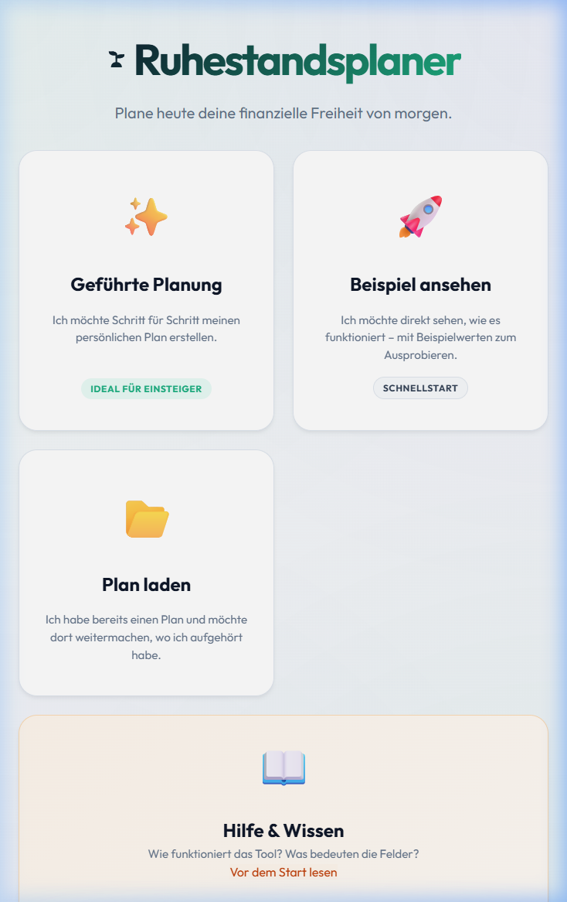
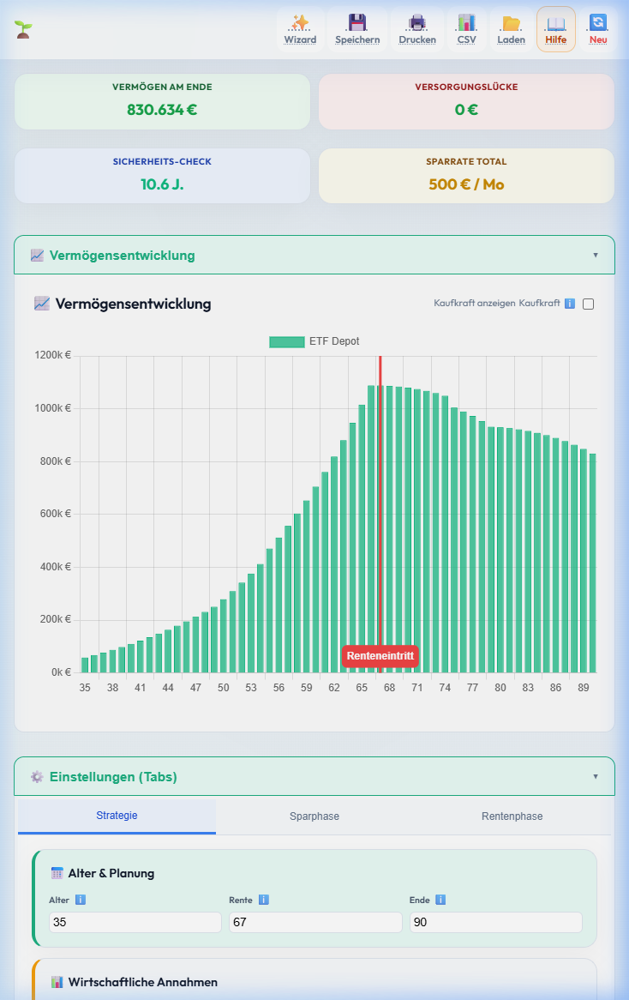
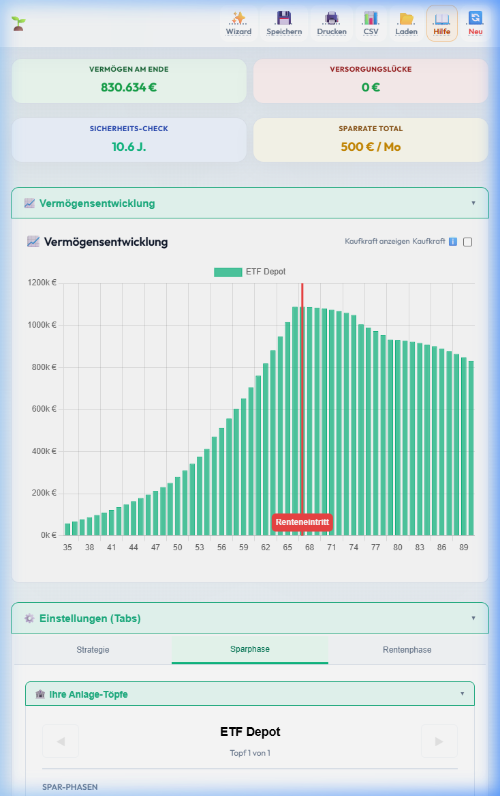
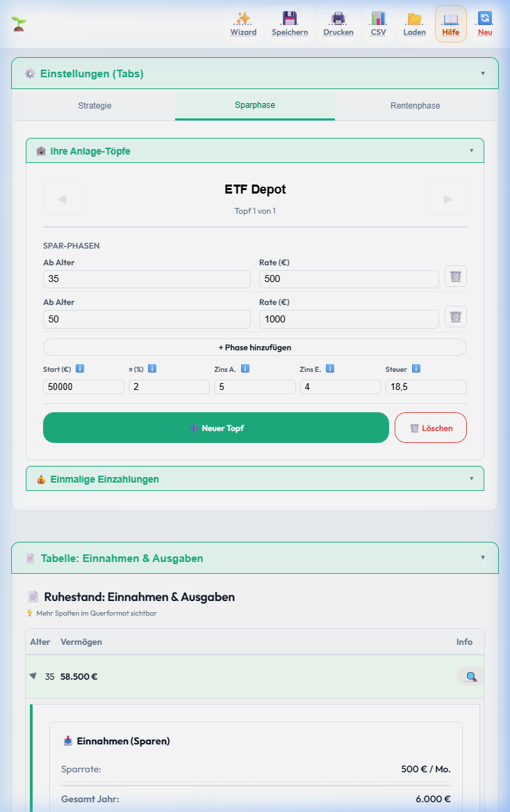

# 🌱 Ruhestandsplaner v1.0

Ein modernes, privatsphäre-fokussiertes Tool zur bankunabhängigen Ruhestandsplanung. Berechnen Sie Ihre Rentenlücke, simulieren Sie verschiedene Sparszenarien und behalten Sie Ihre Vermögensentwicklung im Blick.


## 📸 Impressionen

| Landing Page | Dashboard & Chart |
|:---:|:---:|
|  |  |

| Editor (Anpassung) | Data Details & Reality Check |
|:---:|:---:|
|  |  |

## ✨ Features

- **Multi-Asset-Simulation:** Verwalten Sie verschiedene Töpfe (ETF-Depots, Sparkonten, etc.) mit individuellen Zinssätzen für Spar- und Rentenphase.
- **Dynamische Phasen:** Definieren Sie unterschiedliche Sparraten und Entnahmebedarfe für verschiedene Lebensabschnitte.
- **Realitätscheck (🎯):** Überschreiben Sie simulierte Werte vergangener Jahre mit echten Ist-Werten, um die Simulation laufend zu präzisieren.
- **Inflations-Rechner:** Schalten Sie per Klick zwischen Nominalwerten und realer Kaufkraft um.
- **Sicherheits-Check:** Integrierte KPI zur Erfolgswahrscheinlichkeit Ihrer Strategie (basierend auf der Safe Withdrawal Rate).
- **Daten-Export:** 
    - 📊 **CSV-Export** für die Weiterverarbeitung in Excel.
    - 🖨️ **Druck-Optimierung** für ein sauberes PDF- oder Papier-Handout.
- **Desktop-App:** Kann als eigenständige Windows-Anwendung (`.exe`) installiert werden.

## 🔒 Datenschutz & Sicherheit

Dieses Tool verfolgt einen **"Local-First"** Ansatz:
- **Keine Cloud:** Ihre Finanzdaten werden niemals an einen Server gesendet.
- **Lokale Verarbeitung:** Alle Berechnungen finden direkt in Ihrem Browser (oder der Desktop-App) statt.
- **Dateibasierter Speicher:** Sie können Ihren Plan verschlüsselt als Datei speichern und lokal archivieren.

## 🚀 Installation & Nutzung

### Web-Version (Lokal)
1. Repository klonen oder ZIP herunterladen.
2. `index.html` in einem modernen Browser öffnen (oder per `npx http-server` starten).

### Desktop-Version bauen
Das Projekt nutzt **Electron** und **Electron Forge**:
```bash
cd retirement_planner_desktop
npm install
npm run make
```
Die fertige `setup.exe` findest du anschließend im Ordner `out/make/`.

## 🛠 Technologien

- **Frontend:** Vanilla JS (ES6 modules), HTML5, CSS3 (Glassmorphism Design)
- **Charts:** [Chart.js](https://www.chartjs.org/)
- **Desktop-Wrapper:** [Electron](https://www.electronjs.org/)

---

### Rechtlicher Hinweis
© 2026 Mathias Böhme. 
Alle Berechnungen dieses Tools dienen der Orientierung und sind ohne Gewähr. Dies stellt keine Anlageberatung oder steuerliche Beratung dar.
